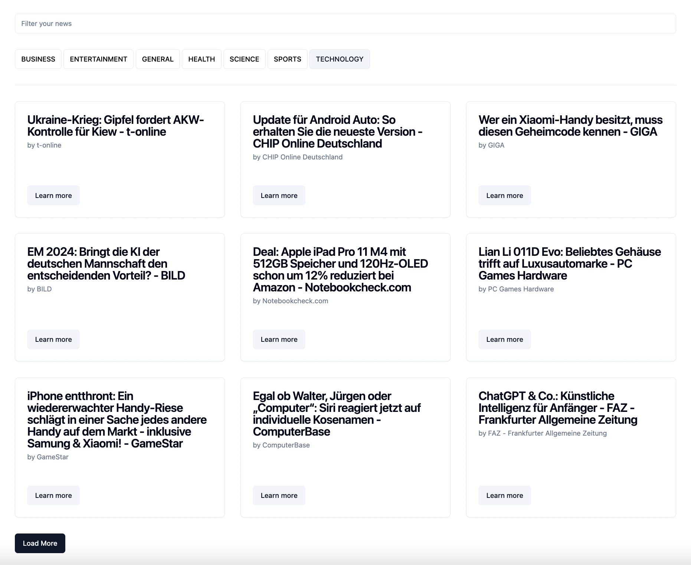

# News Feed

This repository contains a news feed.



The following techstack is used:

- [Vite](https://vitejs.dev/guide/) + JS + React + [shadcn/ui](https://ui.shadcn.com/) to present the information
- [TanStack Query](https://tanstack.com/query/latest) to pull the information from [News API](https://newsapi.org/docs/endpoints/top-headlines)
- [Vitest](https://vitest.dev/) + [React Testing Library](https://testing-library.com/docs/react-testing-library/intro/) + [Nock](https://github.com/nock/nock) for testing

## Setup

To run app locally, please

1. Clone the current repo.
2. Generate an API key for [News API](https://newsapi.org/docs/endpoints/top-headlines) and specify it as an API_KEY const in `src/constants.js` file
3. Run in your terminal

```
npm i
npm run dev
```

4. Navigate http://127.0.0.1:5173/ in your browser.

## Tests

To start tests locally, please run

```
npm run test
```
